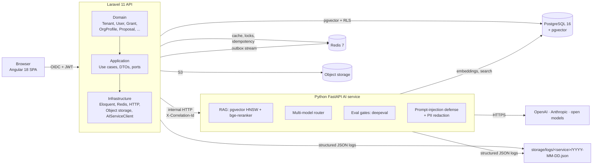

# GrantGenie

> **AI-assisted grant discovery and drafting for small nonprofits.**
> Find the right grants. Draft in minutes with citations. Track every deadline.

[](#status)]
[](#technology-stack)
[](.specify/memory/constitution.md)
[](#license)

---

## What is GrantGenie?

GrantGenie is a multi-tenant SaaS that helps small nonprofits **discover relevant grant opportunities** and **draft funder-aligned proposals** grounded in their own approved materials.

The cost of a single full-time grant writer is **$65k–$95k per year**. GrantGenie is designed to compress the discovery-to-submission cycle from weeks to hours — with citations, eligibility checks, and audit trails your board and auditors can trust.

**Built for "Maya"** — a grant writer at a $250k–$5M nonprofit managing 10–30 active applications per year, who today spends 12–25 hours drafting a single 10-page proposal. With GrantGenie, that's 2–4 hours.

---

## Table of contents

- [What can it do?](#what-can-it-do)
- [Why does it matter?](#why-does-it-matter)
- [How does it work?](#how-does-it-work)
- [Technology stack](#technology-stack)
- [Architecture](#architecture)
- [Project layout](#project-layout)
- [Quick start](#quick-start)
- [Development workflow](#development-workflow)
- [Spec Kit governance](#spec-kit-governance)
- [Testing & validation](#testing--validation)
- [Roadmap](#roadmap)
- [Documentation index](#documentation-index)
- [Contributing](#contributing)
- [License](#license)

---

## What can it do?

GrantGenie has **seven capabilities** organized by priority (P1 = MVP, P2 = closed beta, P3 = public GA):

| # | Capability | What the user does | What the system does |
|---|---|---|---|
| **P1** | **Grant Discovery** | Searches by category, amount, and deadline | Returns only grants the org is **eligible for** (boolean match), with rule citations |
| **P1** | **Org Profile & Library** | Builds a profile, uploads past proposals and reports | Chunks, embeds, and indexes the library for AI retrieval — every AI claim is cited |
| **P1** | **Proposal Drafting** | Selects a grant, clicks "Draft" | Generates a 5-section proposal in under 6 s with citations to the org's own documents |
| **P2** | **Budget Narrative Helper** | Adds budget line items | Writes a narrative explaining each cost in the funder's language |
| **P2** | **Deadline & Submission Tracker** | Tracks deadlines and submission status | In-app + email reminders at **14, 7, and 1 days** before each deadline |
| **P3** | **Funder-Specific Tailoring** | Picks a different funder for the same content | Re-drafts the proposal with distinct language, structure, and emphasis |
| **P3** | **Reviewer Workflow** | Invites a colleague to comment | Reviewers get read-only access; authors hold an exclusive edit lock |

See [`specs/001-grantgenie-core/spec.md`](specs/001-grantgenie-core/spec.md) for the full functional requirements (18 FRs), success criteria (7 SCs), and acceptance scenarios.

---

## Why does it matter?

### The problem

Small nonprofits lose funding to three predictable failure modes:

1. **They don't know the grants exist.** A typical U.S. state has 800+ active RFPs at any time.
2. **They spend 60–80% of proposal time on boilerplate.** Re-typing the org's mission, programs, and metrics for every application.
3. **They submit unfocused proposals.** Missed funder language, missed format, missed priorities.

### The cost of inaction

| Pain point | Industry benchmark | With GrantGenie |
|---|---|---|
| Hours spent discovering eligible grants per quarter | 40–80 h | 2–4 h |
| Time to draft a 10-page proposal | 12–25 h | 2–4 h (author review) |
| Proposal pass-through rate | 15–25% | Designed to **double** in v2 cohort |
| New-staff ramp-up to first submission | 3–6 months | < 2 weeks |

### Why now

- The U.S. philanthropic sector disburses **>$500B per year**; ~10% goes to small/medium nonprofits.
- Foundation RFP volume is growing **8–12% YoY**; staffing has not kept pace.
- AI model quality, citation-grounded generation, and tenant-isolated SaaS architecture are now mature enough to deploy safely for regulated work.

---

## How does it work?

### End-to-end flow

```
┌────────────┐    ┌────────────┐    ┌────────────┐    ┌────────────┐    ┌────────────┐
│ 1. SEARCH  │───▶│ 2. MATCH   │───▶│ 3. DRAFT   │───▶│ 4. REVIEW  │───▶│ 5. SUBMIT  │
│  Grants    │    │ Eligibility│    │  Proposal  │    │  + Approve │    │  + Track   │
└────────────┘    └────────────┘    └────────────┘    └────────────┘    └────────────┘
      │                │                  │                 │                │
      ▼                ▼                  ▼                 ▼                ▼
  Filters:        Boolean pass:        RAG over your    Inline comments,   Email at
  category,       "eligible" or        library, with    resolve loop,     14 / 7 / 1
  amount,         "not eligible" +     citations to     edit lock on      days before
  deadline        rule citations       source docs      author            deadline
```

### Behind the scenes — when you click "Draft"

```
Your org profile + boilerplate  ──┐
                                  │
Selected grant requirements      ──┤
                                  ├──▶  AI Service  ──▶  5-section draft
Grant corpus (50,000+ grants)     │    (multi-model      with citations
                                  │     cost-aware        + eval gates
Past proposals (your library)    ──┘     router)
                                                │
                                                ▼
                                       Relevance ≥ 0.85?
                                       Faithfulness ≥ 0.90?
                                                │
                                          Yes ─┼─ No
                                          │     │
                                          ▼     ▼
                                     Surface   Notify;
                                     to user   offer retry
                                                with higher-tier model
```

**Every AI-generated claim is cited.** Hover a sentence to see the source document, page, and exact chunk. This is what makes the output safe to submit: it is not a black box.

---

## Technology stack

| Concern | Choice | Why |
|---|---|---|
| **Backend API** | PHP 8.3, Laravel 11 | Mature ecosystem, strong typing, well-supported |
| **Frontend** | Angular 18 (standalone, signals) | Type-safe, opinionated structure scales with team |
| **AI service** | Python 3.12, FastAPI, Pydantic v2 | Best-in-class AI/ML libraries (LangChain, sentence-transformers, RAGAS, deepeval) |
| **Database** | PostgreSQL 16 + pgvector | ACID + native vector search in one engine |
| **Cache & locks** | Redis 7 | Idempotency keys, edit locks, rate limiting, sessions |
| **Object storage** | S3-compatible (MinIO in dev, Azure Blob in prod) | PDF/DOCX uploads |
| **Auth** | OIDC / OAuth2 (Auth0) | SSO, social login, passwordless — no custom password store |
| **AI models** | OpenAI, Anthropic, open models via cost-aware router | Best cost/latency per task; automatic fallback on outage |
| **Container / orch** | Docker + Kubernetes (AKS) | Standard, portable, autoscaling |
| **IaC** | Terraform | Versioned, reviewable, multi-environment |
| **CI/CD** | GitHub Actions | PR-blocking checks: lint, tests, SAST, SCA, secrets, eval gates |
| **Tracing** | OpenTelemetry → Jaeger (dev) / Azure Monitor (prod) | Vendor-neutral, full request flow visibility |
| **Eval gates** | deepeval (+ ragas, pending Python 3.13 fix) | Per-spec SC-003 thresholds (relevance ≥ 0.85, faithfulness ≥ 0.90) |

---

## Architecture



Three deployable bounded contexts, each with **Clean Architecture layering** enforced by `phpstan max` + Laravel architecture tests on the backend and `ruff + mypy --strict` on the AI service. Cross-context event spine via **transactional outbox** + **Redis Streams**.

### Why this architecture?

- **Multi-tenant isolation at the database layer** (Postgres RLS) — even a bug in application code cannot leak data across tenants.
- **Transactional outbox** — every state change emits an event in the same DB transaction, drained asynchronously to Redis Streams. No lost events, no double-emit.
- **Cost-aware AI router** — cheapest adequate model first, automatic fallback to higher tier on failure. The constitution's FinOps dashboard tracks per-tenant spend.
- **Eval-gated AI** — relevance and faithfulness scores must pass before any AI output is surfaced.

---

## Project layout

```
GrantGenie/
├── backend/                 # Laravel 11 API (Clean Architecture)
│   ├── app/
│   │   ├── Domain/          # Framework-free entities, value objects, domain events
│   │   ├── Application/     # Use cases, DTOs, ports
│   │   ├── Infrastructure/  # Eloquent, Redis, HTTP, storage, AI client
│   │   ├── Http/Middleware/ # TenantScope, IdempotencyKey, CorrelationId, OIDC, ProblemDetails
│   │   ├── Observability/   # Tracer (OTel stub; full SDK pending ext-grpc)
│   │   ├── Logging/         # Monolog processor (injects correlation_id)
│   │   └── Console/Commands/# outbox:publish
│   ├── database/
│   │   ├── migrations/      # 7 migrations: pgvector, identity, grants, boilerplate, proposals, tracking
│   │   └── seeders/         # RoleSeeder (4 roles per FR-018)
│   ├── tests/
│   │   ├── Architecture/    # CleanArchitectureTest (Constitution Principle II)
│   │   └── Integration/     # Isolation/RlsIsolationTest (SC-005 gate)
│   ├── config/              # auth, logging, ai_service, messaging
│   └── routes/              # api.php (v1 group with oidc + tenant + idempotent middleware)
│
├── frontend/                # Angular 18 SPA
│   ├── src/app/
│   │   ├── core/
│   │   │   ├── auth/        # AuthInterceptor, OidcAuthService, TenantContextService, guards
│   │   │   ├── api/         # ng-openapi-gen typed client (re-export stub)
│   │   │   └── shell/       # AppShell layout
│   │   └── features/        # auth, discovery, org-profile, boilerplate, proposals (stubs)
│   ├── src/environments/    # environment.ts, environment.prod.ts
│   └── e2e/                 # Playwright (Phase 3+)
│
├── ai-service/              # Python 3.12 FastAPI
│   ├── src/grantgenie_ai/
│   │   ├── api/             # main.py, router.py (/healthz, /readyz, /internal/v1 stubs)
│   │   ├── core/            # config (pydantic-settings), logging (structlog), telemetry (OTel)
│   │   ├── retrieval/       # RAG: chunking, embedding, HNSW search (Phase 4)
│   │   ├── generation/      # Multi-model router, prompt templates (Phase 5)
│   │   ├── eval/            # deepeval gates (Phase 5)
│   │   └── safety/          # Prompt-injection defense, PII redaction (Phase 5)
│   └── tests/               # unit, integration (Testcontainers), eval, safety
│
├── infra/                   # Terraform (AKS, Postgres Flexible, Redis Cache, Blob, AI node pool)
│   ├── modules/             # aks, postgres-flexible, redis-cache, blob-storage, ai-gpu-node-pool, networking
│   ├── envs/                # dev, staging, prod
│   ├── cron/                # ingestion-cronjob, reminder-cronjob
│   └── prometheus/          # prometheus.yml
│
├── .github/workflows/       # 6 CI workflows
│   ├── ci-backend.yml       # PHPStan + Pest + RLS isolation gate
│   ├── ci-frontend.yml      # ESLint + Prettier + Karma + Playwright
│   ├── ci-ai-service.yml    # ruff + mypy + pytest + (optional) eval/safety
│   ├── eval-gates.yml       # Daily SC-003 eval threshold
│   ├── security.yml         # SAST (semgrep) + SCA (trivy) + secrets (gitleaks)
│   └── deploy.yml           # Build+push to ACR, deploy to AKS staging
│
├── specs/                   # Spec Kit artifacts
│   └── 001-grantgenie-core/
│       ├── spec.md          # 18 FRs, 7 SCs, 7 user stories
│       ├── plan.md          # Tech stack, architecture, Constitution Check
│       ├── research.md      # 16 resolved technical decisions
│       ├── data-model.md    # 5 bounded contexts, ~20 entities
│       ├── contracts/       # OpenAPI 3.1, AI service HTTP, event catalog
│       ├── quickstart.md    # Validation scenarios mapped to SCs
│       ├── tasks.md         # 172 implementation tasks (T001–T170, T111a)
│       └── checklists/      # requirements.md
│
├── docs/
│   └── client/              # Stakeholder-facing artifacts (see below)
│
├── .specify/                # Spec Kit configuration + constitution
│   ├── memory/constitution.md
│   ├── templates/           # spec, plan, tasks, checklist templates
│   ├── extensions/          # agent-context, etc.
│   └── scripts/bash/        # check-prerequisites, setup-plan, setup-tasks
│
├── docker-compose.yml       # Local dev: postgres+pgvector, redis, minio, mailhog,
│                            #           backend, frontend, ai-service, jaeger,
│                            #           prometheus/grafana (observability profile)
├── Makefile                 # `make help` for 30+ targets
├── .env.example             # 12-factor env template
└── README.md                # ← you are here
```

---

## Quick start

### Prerequisites (macOS)

```bash
brew install php@8.3 composer node uv
# Docker + docker compose + make come with Docker Desktop / CLT
```

### Bring up the local stack

```bash
# 1. Copy env template (fill in OPENAI_API_KEY, ANTHROPIC_API_KEY, OIDC_*, SMTP_*)
cp .env.example .env

# 2. Build and start all services
make up

# 3. Migrate + seed
make migrate
make seed-demo

# 4. Verify
curl -sf http://localhost:8000/api/v1/healthz   # backend
curl -sf http://localhost:8001/healthz          # AI service
curl -sf http://localhost:4200                  # frontend
```

### Run the full validation flow

```bash
make check            # lint (phpstan + pint + eslint + prettier + ruff + mypy) + tests
make e2e-p1           # Playwright E2E for P1 user stories
make validate-nfrs    # SC-001/002/003/005/006/007 all measured
make load-test-smoke  # k6 load tests for SC-001 (< 5 s) and SC-002 (< 6 s)
make eval-gates       # SC-003 eval-gate threshold test
make security-scan    # SAST + SCA + secret scan
```

### Tear down

```bash
make down             # stop containers, preserve volumes
make down-clean       # stop + delete volumes (destructive)
```

---

## Development workflow

All work runs through the **Spec Kit** flow (dot separator):

```
/speckit.specify   <description>     →  specs/<NNN>-feature/spec.md
/speckit.clarify                      →  Q&A to reduce ambiguity (≤5 questions)
/speckit.plan                          →  plan.md, research.md, data-model.md
/speckit.analyze                      →  consistency report across the three artifacts
/speckit.tasks                        →  tasks.md (phased, per-user-story)
/speckit.implement                    →  execute tasks in order, commit per task
```

Review gates pause between steps for approval. Every requirement carries a traceability ID (`FR-NNN`, `SC-NNN`) referenced by tasks, tests, code, and AI eval cases.

### Commit cadence

One commit per task or logical group. Commit messages follow Conventional Commits:

```
feat(scope): short summary
fix(scope): short summary
chore(scope): short summary
docs(scope): short summary
test(scope): short summary
```

---

## Spec Kit governance

The project operates under the **GrantGenie Constitution** at [`.specify/memory/constitution.md`](.specify/memory/constitution.md). The constitution codifies five non-negotiable principles:

1. **Spec-First Development** — every feature starts with an executable spec
2. **Clean Architecture & DDD** — dependencies point inward; violations caught by automated architectural tests
3. **Test-Driven & Evaluation-Gated Quality** — TDD required; AI outputs gated by relevance/faithfulness thresholds in CI
4. **Security & Multi-Tenant Isolation** — every table carries a tenant key; RLS enforced; OIDC + RBAC; prompt-injection defense; PII redaction
5. **Observability & Cost Awareness** — structured JSON logs with correlation IDs; cost-aware AI router; FinOps dashboards; GPU scale-to-zero

**Amendments** require a documented ADR, review by the Solution Architect, a version bump, and propagation to affected templates and agent instructions. See the constitution's Governance section for the full process.

---

## Testing & validation

| Layer | Tool | Command | What it proves |
|---|---|---|---|
| Backend unit + feature | Pest 3 | `cd backend && vendor/bin/pest` | All PHP behavior correct |
| Backend architecture | PHPStan (larastan, level max) | `cd backend && vendor/bin/phpstan analyse` | Domain has no Infrastructure, Application has no Infrastructure, etc. (Constitution Principle II) |
| Backend SC-005 gate | Pest | `cd backend && vendor/bin/pest tests/Integration/Isolation` | Cross-tenant RLS returns zero rows |
| Frontend unit | Karma + Jasmine | `cd frontend && npm test` | All TS behavior correct |
| Frontend lint | ESLint + Prettier | `cd frontend && npx eslint . && npx prettier --check .` | Style + a11y + rules compliance |
| Frontend E2E | Playwright | `cd frontend && npx playwright test` | User stories work end-to-end |
| AI service unit + integration | pytest + Testcontainers | `cd ai-service && uv run --frozen pytest` | All Python behavior correct |
| AI service eval gate | deepeval | `cd ai-service && uv run --frozen pytest -m eval` | SC-003: relevance ≥ 0.85, faithfulness ≥ 0.90 on frozen dataset |
| AI service safety | pytest | `cd ai-service && uv run --frozen pytest -m safety` | Prompt-injection defense + PII redaction |
| Performance (SC-001/002) | k6 | `tests/load/discovery.js`, `tests/load/draft.js` | p95 within budget |
| SAST | semgrep | (CI) `.github/workflows/security.yml` | No high/critical static findings |
| SCA | trivy | (CI) `.github/workflows/security.yml` | No high/critical dependency findings |
| Secret scan | gitleaks | (CI) `.github/workflows/security.yml` | No secrets in repo |

### Current test status

```
Phase 1 (Setup):        10/10 ✓
Phase 2 (Foundational): 28/28 ✓
Phase 3 (US1):           0/25
Phase 4 (US2):           0/24
Phase 5 (US3):           0/24
Phase 6 (US4):           0/9
Phase 7 (US5):           0/14
Phase 8 (US6):           0/7
Phase 9 (US7):           0/14
Phase 10 (Polish):       0/15
─────────────────────────────
Total:                  38/172 (22%)
```

---

## Roadmap

| Quarter | Milestone |
|---|---|
| **Q3 2026** | **Phase 1–2 complete** (scaffold + foundation). **Phase 3: US1 Grant Discovery (MVP) in flight.** |
| **Q4 2026** | Phase 4–5: US2 Org Profile + Library, US3 Proposal Drafting. Internal alpha. End-to-end P1 MVP. |
| **Q1 2027** | Phase 6–7: US4 Budget Narrative, US5 Tracking. **Closed beta with 10 nonprofits.** |
| **Q2 2027** | Phase 8–9: US6 Funder Tailoring, US7 Reviewer Workflow. **Public GA.** |
| **Q3 2027+** | Outcome tracking integration, foundation CRM connectors, multi-language. |

---

## Documentation index

### Engineering
- **Spec**: [`specs/001-grantgenie-core/spec.md`](specs/001-grantgenie-core/spec.md) — 18 FRs, 7 SCs, 7 user stories, edge cases
- **Plan**: [`specs/001-grantgenie-core/plan.md`](specs/001-grantgenie-core/plan.md) — tech stack, architecture, Constitution Check
- **Research**: [`specs/001-grantgenie-core/research.md`](specs/001-grantgenie-core/research.md) — 16 resolved technical decisions
- **Data model**: [`specs/001-grantgenie-core/data-model.md`](specs/001-grantgenie-core/data-model.md) — 5 bounded contexts, ~20 entities
- **API contracts**: [`specs/001-grantgenie-core/contracts/`](specs/001-grantgenie-core/contracts/) — OpenAPI 3.1, AI service HTTP, event catalog
- **Quickstart**: [`specs/001-grantgenie-core/quickstart.md`](specs/001-grantgenie-core/quickstart.md) — validation scenarios mapped to SCs
- **Tasks**: [`specs/001-grantgenie-core/tasks.md`](specs/001-grantgenie-core/tasks.md) — 172 implementation tasks
- **Constitution**: [`.specify/memory/constitution.md`](.specify/memory/constitution.md) — 5 core principles, mandated stack, governance

### Client & stakeholder
- **Client documentation**: [`docs/client/GrantGenie-Client-Documentation.md`](docs/client/GrantGenie-Client-Documentation.md) — comprehensive stakeholder guide
- **LinkedIn pitch**: [`docs/client/GrantGenie-LinkedIn-Pitch.md`](docs/client/GrantGenie-LinkedIn-Pitch.md) — 120-second pitch + 3 audience variants
- **Presentation deck**: [`docs/client/GrantGenie-Presentation.pptx`](docs/client/GrantGenie-Presentation.pptx) — 15-slide PowerPoint

---

## Contributing

This is a Spec Kit scaffold. To add a new feature:

1. **Specify** — `/speckit.specify <description>` produces a new spec under `specs/<NNN>-feature/`
2. **Clarify** — `/speckit.clarify` resolves up to 5 ambiguities before planning
3. **Plan** — `/speckit.plan` generates plan.md, research.md, data-model.md
4. **Analyze** — `/speckit.analyze` checks cross-artifact consistency
5. **Tasks** — `/speckit.tasks` produces a phased task breakdown
6. **Implement** — `/speckit.implement` executes tasks in order, with per-task commits

Every PR must pass: unit tests, integration tests, AI eval gates (where applicable), SAST/SCA/secret scan, and performance budget checks before merging.

---

## License

Proprietary. © 2026 GrantGenie. All rights reserved.

The constitution (`.specify/memory/constitution.md`) is the source of truth for project governance. Amendments require a documented ADR per the constitution's Governance §3.
