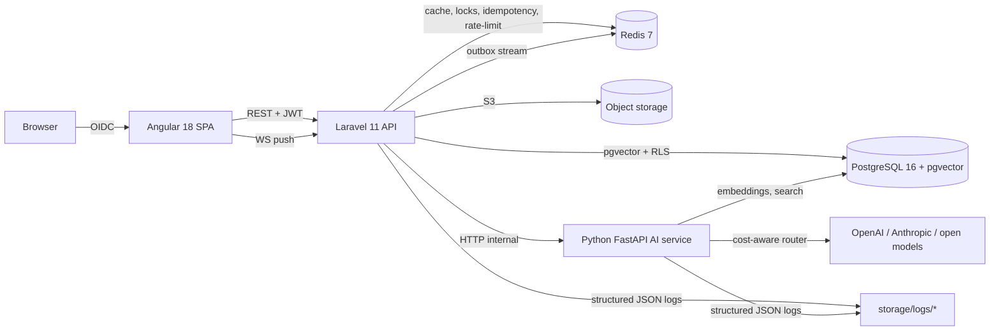

# GrantGenie

A multi-tenant SaaS that helps small nonprofits discover relevant grant opportunities and draft funder-aligned proposals grounded in their own approved materials.

> **Status**: MVP scaffold (Phase 1 complete). See `specs/001-grantgenie-core/quickstart.md` for the validation flow.

## Architecture



Three deployable bounded contexts, each with Clean Architecture layering enforced by `phpstan max` + Laravel architecture tests on the backend and `ruff + mypy --strict` on the AI service. Cross-context event spine via transactional outbox + Redis Streams.

## Stack

| Concern | Choice |
|---|---|
| Backend | PHP 8.3+ / Laravel 11 |
| Frontend | Angular 18 (standalone, signals) |
| AI service | Python 3.12+ / FastAPI / Pydantic v2 |
| Database | PostgreSQL 16 + pgvector |
| Cache | Redis 7 |
| Object storage | S3-compatible (MinIO in dev, Azure Blob in prod) |
| Container/Orchestration | Docker + Kubernetes (AKS) |
| IaC | Terraform |
| CI/CD | GitHub Actions |
| Tracing | OpenTelemetry → Jaeger (dev) / Azure Monitor (prod) |
| Eval gates | deepeval (+ ragas, pending Python 3.13 fix) |

## Project layout

```
backend/          Laravel 11 API (Clean Architecture: Domain → Application → Infrastructure)
frontend/         Angular 18 SPA (standalone components, signals, NG-ZORRO UI)
ai-service/       FastAPI service (RAG, multi-model router, eval gates, safety)
infra/            Terraform (AKS, Postgres Flexible, Redis Cache, Blob, AI node pool)
.github/          CI workflows (ci-backend, ci-frontend, ci-ai-service, eval-gates, security, deploy)
specs/            Spec Kit artifacts
  001-grantgenie-core/
    spec.md       Feature spec (18 FRs, 7 SCs, 7 user stories)
    plan.md       Implementation plan + Constitution Check
    research.md   16 resolved technical decisions
    data-model.md 5 bounded contexts, ~20 entities
    contracts/    OpenAPI 3.1, AI service HTTP, event catalog
    quickstart.md Validation scenarios mapping to SCs
    tasks.md      171 implementation tasks (T001–T170, T111a)
docker-compose.yml Local dev stack
Makefile          Workflow entrypoints (see `make help`)
```

## Quick start

```bash
# 1. Install prereqs (macOS): PHP 8.3, Composer, Node 20, uv, Docker, make
brew install php@8.3 composer node uv

# 2. Copy env template
cp .env.example .env  # fill in OPENAI_API_KEY, ANTHROPIC_API_KEY, OIDC_*, SMTP_*

# 3. Bring up the stack
make up

# 4. Migrate + seed
make migrate
make seed-demo

# 5. Validate
make check         # lint + tests
make e2e-p1        # E2E for P1 user stories
make validate-nfrs # SC-001/002/003/005/006/007 all measured
```

## Documentation

- **Spec**: [`specs/001-grantgenie-core/spec.md`](specs/001-grantgenie-core/spec.md)
- **Plan**: [`specs/001-grantgenie-core/plan.md`](specs/001-grantgenie-core/plan.md)
- **Quickstart**: [`specs/001-grantgenie-core/quickstart.md`](specs/001-grantgenie-core/quickstart.md)
- **Constitution**: [`.specify/memory/constitution.md`](.specify/memory/constitution.md)

## Governance

Spec-first development, Clean Architecture, TDD with AI eval gates, multi-tenant isolation by construction, observability and cost awareness. Amendments to the constitution require a documented ADR per `.specify/memory/constitution.md` Governance §3.
